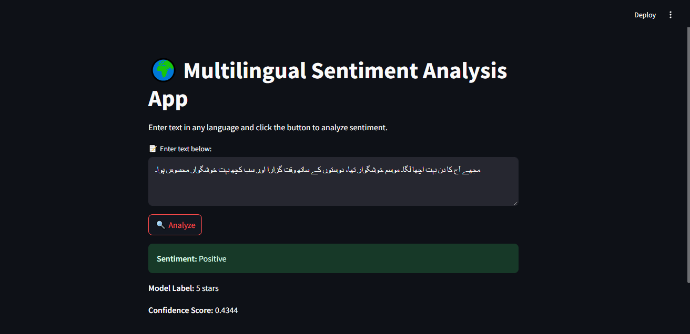

# SentimentScope

## Screenshot

### 🖼️ App Homepage




# Multilingual Sentiment Analysis App

This is a **Multilingual Sentiment Analysis** web application built using **Streamlit** and **Hugging Face's Transformers** library. The app allows users to input text in any language and it performs sentiment analysis to determine if the sentiment is **Positive**, **Neutral**, or **Negative**.

---

## Table of Contents

1. [Project Overview](#project-overview)
2. [Tech Stack](#tech-stack)
3. [Features](#features)
4. [Installation Guide](#installation-guide)
5. [Usage](#usage)
6. [Creating the `requirements.txt`](#creating-the-requirementstxt)
7. [Contributing](#contributing)
8. [License](#license)

---

## Project Overview

This project leverages the **Streamlit** framework to build an easy-to-use interface and **Hugging Face's Transformers** library to perform sentiment analysis using a pre-trained multilingual BERT-based model. The sentiment is classified into three categories: **Positive**, **Neutral**, and **Negative** based on the input text.

---

## Tech Stack

- **Streamlit**: Web framework for creating interactive apps using Python.
- **Transformers**: Hugging Face library for pre-trained NLP models.
- **Torch**: Deep learning framework used to run the model.

---

## Features

- **Multilingual Support**: The app supports text inputs in multiple languages.
- **Sentiment Analysis**: Classifies sentiment as **Positive**, **Neutral**, or **Negative**.
- **Confidence Score**: Displays the model's confidence in its prediction.
- **User-friendly Interface**: Simple and clean UI built with Streamlit.
- **Efficient**: Uses a cached model to avoid reloading on each request.

---

## Installation Guide

Follow these steps to get the project up and running on your local machine:

### 1. Clone the repository

Open your terminal and run the following command to clone the project:

```bash
git clone https://github.com/Maddy10/SentimentScope.git
cd multilingual-sentiment-analysis-app


python -m venv venv
.\venv\Scripts\activate
pip install -r requirements.txt
streamlit run app.py


